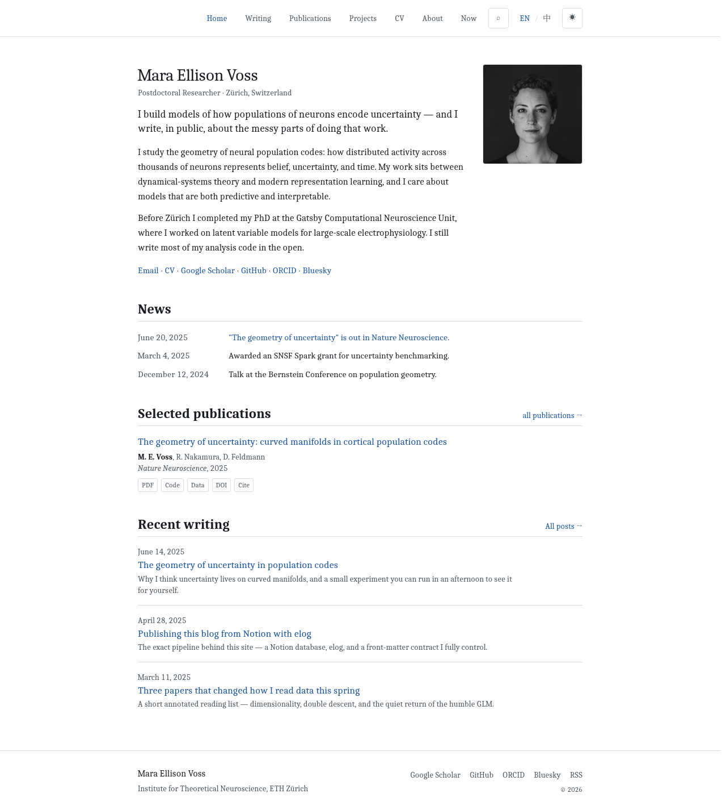
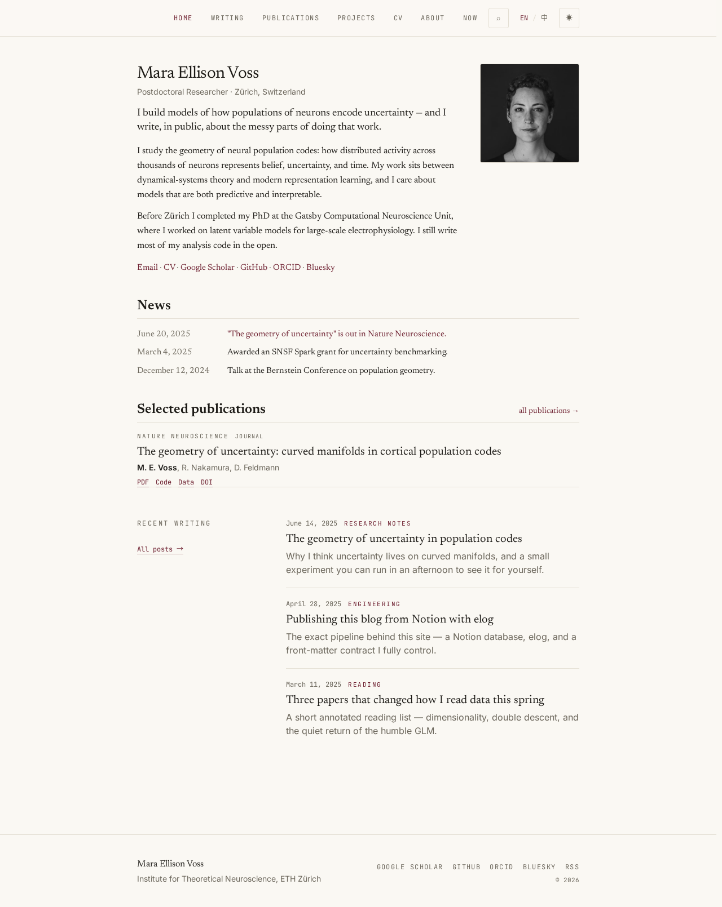
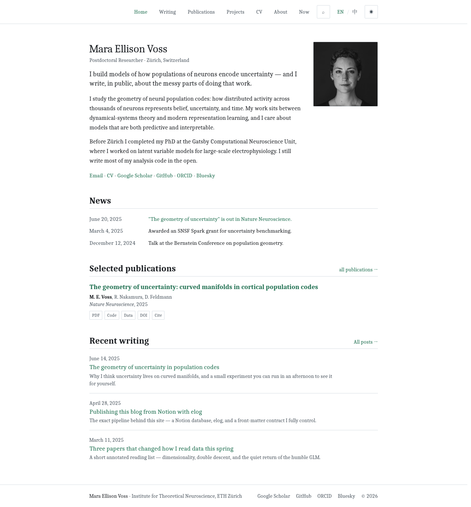
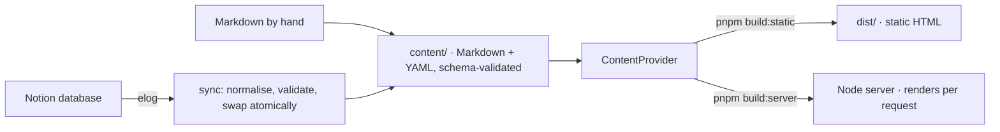

<h1 align="center">Offprint</h1>

<p align="center">
  An academic personal website you write in Notion and deploy anywhere:<br>
  a static site on GitHub Pages, or a server-rendered container that goes live the moment you press <em>publish</em>.
</p>

<p align="center">
  <a href="https://mouwumou.github.io/Offprint/"><strong>Live demo</strong></a> ·
  <a href="https://github.com/mouwumou/Offprint/generate"><strong>Use this template</strong></a> ·
  <a href="https://mouwumou.github.io/Offprint/docs/">Documentation</a> ·
  <a href="docs/README.zh-CN.md">中文</a>
</p>

<p align="center">
  <a href="https://github.com/mouwumou/Offprint/actions/workflows/ci.yml"></a>
  
  
  
</p>

<p align="center">
  <a href="https://mouwumou.github.io/Offprint/"></a>
</p>

## Why Offprint

Most academic site generators make you choose: write Markdown and manage a repository, or write in a CMS and accept its hosting. Offprint separates writing, content and hosting so each can be swapped without touching the others.

- **Write where you already write.** Blog posts come from a Notion database through [elog](https://elog.1874.cool) and land in your repository as plain Markdown with a documented front-matter contract. Markdown written by hand goes through the same door. The site never calls Notion at build or run time, so nothing breaks when Notion is slow, changes, or is gone.
- **Deploy on whatever you have.** One codebase builds a fully static site (a GitHub Pages workflow is included) or runs as a Node server in a container (Docker Compose files are included), where "publish in Notion" is live within seconds. Both modes produce identical HTML, and CI proves it on every commit. There are no serverless adapters and no platform-specific files to maintain.
- **Academic by default.** A publication list with a Cite dialog and the Highwire Press meta tags Google Scholar reads, `[@key]` citations rendered into a reference list, KaTeX, a CV from JSON Resume, English and Chinese as first-class languages, and zero JavaScript unless a component truly needs it.

## What you get

| | |
| --- | --- |
| **Pages** | A home page assembled from blocks you order in `content/home.yaml`; a blog with categories, tags, series, related posts and a table of contents; publications grouped by year with a Cite dialog (BibTeX, APA, MLA, Chicago) and optional per-paper pages; projects; a CV from JSON Resume with a print stylesheet, or a link straight to your PDF; standalone pages such as About and Now. Switch any module off and it leaves the navigation, the routes and the bundle. |
| **Writing** | Notion → elog → Markdown, or Markdown by hand. KaTeX math, Shiki code highlighting, `[@key]` citations with a reference list, callout blocks, cover images. Images from Notion are downloaded into `content/assets/`, so posts never depend on Notion's expiring URLs. |
| **Findability** | Canonical, Open Graph, JSON-LD and Highwire Press meta; generated OG images; RSS, Atom and JSON feeds; sitemap; site search with pagefind and no external service; redirects for old URLs; per-language `noindex`; optional visitor statistics with Umami, Plausible or GoatCounter, off by default. |
| **Languages** | English and Chinese routing with the default language at the root path, every page reachable in both, `hreflang` alternates, and content fields written as `{ en, zh }` or a single string. |
| **Appearance** | Two built-in themes (`scholar`, the academic default, and `paper`, a magazine feel), a shipped sample theme (`gutter`), light and dark mode, and one `site.yaml` for every knob. A theme is a plain directory: tokens in `theme.json`, restyling through stable `data-part` hooks in `theme.css`, whole widgets replaceable. |
| **Runtime** | Astro 7. Zero JavaScript by default; islands only for the theme toggle, the Cite dialog and search. CI runs a dual-mode HTML parity check, a sub-path deployment check, an axe accessibility audit, a phone-viewport check and Lighthouse with a 0.95 threshold in every category. |

## Quick start

### Path A: GitHub Pages, nothing to install

1. Click **Use this template** and create your repository. A private repository works on paid GitHub plans.
2. Wait for the first workflow run, two or three minutes. Your site is at `https://<user>.github.io/<repo>/`: the workflow turns Pages on for the repository and detects the URL, sub-path included. For a custom domain, set it under *Settings → Pages* and the next run picks it up.

### Path B: on your machine

```bash
pnpm install
pnpm dev             # http://localhost:4321 with the sample content
pnpm build:static    # static site → dist/
pnpm build:server    # server bundle (Node adapter) → dist/
```

### Path C: Docker, static or server

```bash
cp .env.example .env                            # SITE_URL, plus NOTION_TOKEN / NOTION_DB if you sync
docker compose -f compose.static.yaml up -d --build   # Caddy serves the build; a sidecar re-syncs, rebuilds and swaps releases
docker compose -f compose.server.yaml up -d --build   # server mode: renders per request; Notion webhook or polling keeps it fresh
```

Any host with a container runtime and a persistent volume works: a VPS, Cloudflare Containers, a home server. Details, custom domains and verification in the [deployment guide](docs/en/guide/deployment.md).

## Make it yours

| You want to change | Edit |
| --- | --- |
| Who you are: name, title, affiliation, photo, bio, links | `content/profile.yaml` |
| Which modules exist, navigation, theme, languages, comments, analytics, redirects | `site.yaml` |
| The blocks on the home page and their order | `content/home.yaml` |
| Publications, projects, CV, news | `content/publications.yaml`, `projects.yaml`, `cv.yaml`, `news.yaml` |
| Standalone pages (About, Now, …) | `content/pages/<slug>.<lang>.md` |
| Blog posts | Notion through sync, or `content/posts/<urlname>.<lang>.md` |

Every file is validated against a schema at build time: a typo fails the build and names the line. The `schema/` directory holds JSON Schemas, so a `$schema` comment gives you completion and inline errors in VS Code. Step by step in the [getting-started guide](docs/en/guide/getting-started.md); every option in the [configuration guide](docs/en/guide/configuration.md).

### Publishing from Notion

- **Locally:** put `NOTION_TOKEN` and `NOTION_DB` in `.env` and run `pnpm sync`. Posts are normalised, validated and swapped into `content/posts/` atomically.
- **GitHub Pages:** add the same two values as repository secrets and set the repository variable `SYNC_ENABLED=true`. Actions syncs every 30 minutes, commits changed content and redeploys.
- **Server mode:** the sync sidecar polls on an interval, or Notion's webhook hits the site directly; either way pages re-render on the next request, seconds after you publish.

The [Notion database template](docs/en/guide/notion-template.md) defines the database (a NotionNext database plugs in unchanged) and the [sync guide](docs/en/guide/sync.md) covers the three modes and the webhook handshake.

## Themes

<p align="center">
  
  
  
</p>
<p align="center"><sub><code>scholar</code> (default) · <code>paper</code> · <code>gutter</code> (the shipped sample, which also restyles the publications page)</sub></p>

A theme is a directory under `extensions/themes/` with three optional layers: `theme.json` (colour tokens for light and dark, font stacks, voice presets, the theme's own options), `theme.css` (restyle anything through stable `data-part` hooks, no Tailwind class names involved) and `widgets/` (replace a whole part, such as the publication row or the footer, with the same props as the built-in). The sample theme in `extensions/themes/gutter/` demonstrates all three with a per-file README; copy it, rename it, and run `pnpm theme:check <name>` to prove your theme against both builds and the full e2e suite. Full contract in [the theming guide](docs/en/THEMING.md).

## How it works



Four rules keep the two runtimes from drifting apart: pages read content only through the provider, never from the filesystem; every collection is validated by one schema at build time and at request time; a module switched off produces no route, no navigation entry and no bundle; and only the sync layer knows Notion exists. Design documents: [architecture](docs/ARCHITECTURE.md), [architecture decisions](docs/DECISIONS.md), [content contract](docs/CONTENT-CONTRACT.md), [server-mode publishing](docs/DYNAMIC-PUBLISHING.md).

## Template and instance

This repository is a **public template**. It ships sample content, builds on its own, and its CI and demo deploy use only `GITHUB_TOKEN`: it holds no secrets and never will. Your site is an **instance repository** generated from it with *Use this template*, which is cleaner than a fork because it carries no development history. Everything an instance may need lives in your own repository's settings, and all of it is optional:

| Kind | Name | When |
| --- | --- | --- |
| Variable | `SITE_URL` | Detected automatically on GitHub Pages, sub-paths included; set it for a custom domain or another platform |
| Variable | `SYNC_ENABLED=true` | To let Actions sync from Notion every 30 minutes |
| Secret | `NOTION_TOKEN`, `NOTION_DB` | Same |

With nothing set, a push yields a static site on GitHub Pages and the sync workflow shows as skipped. Self-hosted secrets live only in the server's local `.env`. To pick up later template releases, run `scripts/upgrade-from-template.sh` from a checkout of this repository's `main`; it never touches your content, configuration or extensions.

## Commands

| Command | What it does |
| --- | --- |
| `pnpm dev` | Development server with the sample content |
| `pnpm build:static` / `pnpm build:server` | Static site / server bundle |
| `pnpm sync` | Notion → `content/` (needs `.env`); `pnpm sync validate` checks `content/` only |
| `pnpm test` | Unit tests: schemas, store, provider, Markdown pipeline |
| `pnpm e2e` | Playwright: smoke, dual-mode parity, sub-path, accessibility, phone viewport |
| `pnpm lhci` | Lighthouse CI, desktop preset, 0.95 thresholds |
| `pnpm theme:check <name>` | Both builds plus the whole e2e suite against one theme |
| `pnpm gen:schema` | Regenerate the JSON Schemas used for editor completion |
| `pnpm check:live <url>` | Crawl a deployed site's sitemap and report broken pages |

Requirements: Node 22 or newer and pnpm.

## Documentation

The documentation site at **https://mouwumou.github.io/Offprint/docs/** has the guides in English and Chinese, with search. The same Markdown lives in [docs/](docs/README.md): [getting started](docs/en/guide/getting-started.md) · [configuration](docs/en/guide/configuration.md) · [Notion database template](docs/en/guide/notion-template.md) · [Notion sync](docs/en/guide/sync.md) · [deployment](docs/en/guide/deployment.md) · [theming](docs/en/THEMING.md). The design documents (architecture, decisions, content contract, server-mode publishing) are in Chinese. `site.yaml`, `content/home.yaml` and `.env.example` carry inline comments for every key.

## Status

All core features are complete and gated in CI by the dual-mode parity, sub-path, accessibility, phone-viewport and Lighthouse checks, plus the theme gate for `paper` and `gutter`. Development happens on the `dev` branch; `main` is a clean release snapshot without the working documents. Task list: [ROADMAP on dev](https://github.com/mouwumou/Offprint/blob/dev/docs/dev/ROADMAP.md).

## Contributing and security

Questions and "built with Offprint" showcases go to [Discussions](https://github.com/mouwumou/Offprint/discussions). Issues and pull requests are welcome in English or Chinese; see [CONTRIBUTING.md](.github/CONTRIBUTING.md) for the workflow and the code constraints. Report vulnerabilities privately as described in [SECURITY.md](.github/SECURITY.md), not in a public issue.

## Acknowledgements

- [NotionNext](https://github.com/tangly1024/NotionNext) showed that the Notion side is half the product. Its database convention (`type`, `status`, `slug`, `category`, `summary`) is what Offprint reads, so a NotionNext database plugs in unchanged. Offprint exists because the maintainer's NotionNext site needed a home other than a serverless platform.
- [elog](https://elog.1874.cool) is the Notion-to-Markdown sync behind `pnpm sync`.
- [al-folio](https://github.com/alshedivat/al-folio) set the bar for what an academic home page needs: publications by year with links and a Cite dialog, news, projects, a data-driven CV.
- Built on [Astro](https://astro.build); the documentation site runs on [Starlight](https://starlight.astro.build).

## License

MIT.
