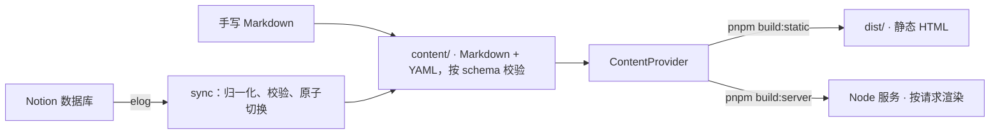

<h1 align="center">Offprint</h1>

<p align="center">
  在 Notion 里写、随处部署的学术个人网站：<br>
  可以是 GitHub Pages 上的纯静态站，也可以是容器里的服务端渲染站——按下"发布"，几秒后就是线上。
</p>

<p align="center">
  <a href="https://mouwumou.github.io/Offprint/"><strong>在线 demo</strong></a> ·
  <a href="https://github.com/mouwumou/Offprint/generate"><strong>Use this template</strong></a> ·
  <a href="README.md">文档</a> ·
  <a href="../README.md">English</a>
</p>

<p align="center">
  <a href="https://github.com/mouwumou/Offprint/actions/workflows/ci.yml"></a>
  
  
  
</p>

<p align="center">
  <a href="https://mouwumou.github.io/Offprint/"></a>
</p>

## 为什么是 Offprint

多数学术建站工具让你二选一：写 Markdown、自己管仓库；或者在某个 CMS 里写、接受它的托管。Offprint 把"写作、内容、托管"三件事拆开，每一件都能单独替换，互不牵连。

- **在你已经在用的地方写。** 博客文章从 Notion 数据库经 [elog](https://elog.1874.cool) 落进你的仓库，变成带约定 front-matter 的普通 Markdown；手写 Markdown 走同一个入口。站点在构建期和运行期都不请求 Notion，Notion 慢了、改了、没了，站点照常。
- **有什么就部署到什么上。** 一套代码既能编译成纯静态站（自带 GitHub Pages 工作流），也能作为 Node 服务跑在容器里（自带 Docker Compose 文件），做到"在 Notion 点发布，几秒后上线"。两种模式输出完全相同的 HTML，CI 每次提交都逐页比对。没有 serverless 适配层，没有平台专属文件。
- **学术需求是默认项。** 出版物列表带 Cite 弹窗和 Google Scholar 能读的 Highwire Press meta；正文里 `[@key]` 引用自动生成参考文献；KaTeX；JSON Resume 驱动的 CV；中英双语是一等公民；除非组件真的需要交互，否则不发一行 JavaScript。

## 你会得到什么

| | |
| --- | --- |
| **页面** | 首页由 `content/home.yaml` 里排好顺序的块拼成；博客有分类、标签、系列、相关文章与目录；出版物按年份分组，带 Cite 弹窗（BibTeX、APA、MLA、Chicago），单篇论文页可开可关；项目；JSON Resume 格式的 CV，自带打印样式，也可以直接指向你的 PDF；About、Now 这类独立页面。关掉任何模块，它就从导航、路由和打包里一起消失。 |
| **写作** | Notion → elog → Markdown，或者手写 Markdown。KaTeX 公式、Shiki 代码高亮、`[@key]` 引用与参考文献、提示框、封面图。Notion 里的图片会下载进 `content/assets/`，文章不依赖 Notion 会过期的图片链接。 |
| **可发现性** | canonical、Open Graph、JSON-LD、Highwire Press meta；自动生成 OG 图；RSS、Atom、JSON 三种 feed；sitemap；基于 pagefind 的站内搜索，不依赖外部服务；旧链接跳转；按语言设置 `noindex`。 |
| **语言** | 中英双语路由，默认语言走根路径，每个页面两种语言都可达，带 `hreflang`；内容字段既可以写 `{ en, zh }`，也可以只写一个字符串。 |
| **外观** | 内置两套主题（`scholar` 学术默认、`paper` 杂志纸面风）和一套随模板分发的示例主题（`gutter`），深浅色模式，所有可调项都在一份 `site.yaml` 里。主题就是一个目录：`theme.json` 放 token，`theme.css` 通过稳定的 `data-part` 挂钩改任何样式，`widgets/` 整个替换部件。 |
| **运行时** | Astro 7。默认零 JavaScript，只有主题切换、Cite 弹窗和搜索是 island。CI 跑双模式 HTML 一致性、子路径部署、axe 无障碍、手机视口，以及四项都不低于 0.95 的 Lighthouse。 |

## 快速开始

### 路线 A：GitHub Pages，什么都不用装

1. 点 **Use this template** 生成你的仓库。付费版 GitHub 私有仓库也能部署。
2. 在新仓库打开 *Settings → Pages*，把 *Source* 设为 **GitHub Actions**。
3. 推送一次，或等第一次工作流跑完。站点在 `https://<user>.github.io/<repo>/`。工作流会自动识别地址，子路径也不用配；自定义域名就设置仓库变量 `SITE_URL`。

### 路线 B：本机

```bash
pnpm install
pnpm dev             # http://localhost:4321，示例内容开箱可见
pnpm build:static    # 纯静态站 → dist/
pnpm build:server    # server 模式产物（Node adapter）→ dist/
```

### 路线 C：Docker，static 或 server

```bash
cp .env.example .env                            # SITE_URL；要同步 Notion 再加 NOTION_TOKEN / NOTION_DB
docker compose -f compose.static.yaml up -d --build   # Caddy 伺服构建产物；边车定时同步、重建、原子切换
docker compose -f compose.server.yaml up -d --build   # server 模式：按请求渲染；Notion webhook 或轮询保持最新
```

任何有容器运行时和持久卷的地方都行：VPS、Cloudflare Containers、家里的机器。细节、自定义域名与部署后验证见[部署指南](guide/deployment.md)。

## 变成你的站

| 想改什么 | 改哪里 |
| --- | --- |
| 你是谁：姓名、职衔、机构、头像、简介、链接 | `content/profile.yaml` |
| 开哪些模块、导航、主题、语言、评论、跳转 | `site.yaml` |
| 首页有哪些块、什么顺序 | `content/home.yaml` |
| 出版物、项目、CV、近况 | `content/publications.yaml`、`projects.yaml`、`cv.yaml`、`news.yaml` |
| 独立页面（About、Now……） | `content/pages/<slug>.<lang>.md` |
| 博客文章 | Notion 经同步写入，或手放 `content/posts/<urlname>.<lang>.md` |

每个文件构建时都按 schema 校验：写错一个键，构建直接失败并指出行号。`schema/` 目录里是 JSON Schema，文件头加一行 `$schema` 注释，VS Code 就有补全和即时报错。逐步操作见[快速开始](guide/getting-started.md)，全部选项见[配置体系](guide/configuration.md)。

### 从 Notion 发布

- **本机：** 把 `NOTION_TOKEN` 和 `NOTION_DB` 写进 `.env`，运行 `pnpm sync`。文章经归一化、校验后原子地切换进 `content/posts/`。
- **GitHub Pages：** 把同样两个值加为仓库 Secrets，再设置仓库变量 `SYNC_ENABLED=true`。Actions 每 30 分钟同步一次，内容有变化就提交并重新部署。
- **server 模式：** 同步边车按间隔轮询，或者 Notion 的 webhook 直接打到站点；两种方式都让页面在下一次请求时重新渲染，发布后几秒可见。

Notion 数据库怎么建、webhook 怎么握手，见[同步指南](guide/sync.md)。

## 主题

<p align="center">
  
  
  
</p>
<p align="center"><sub><code>scholar</code>（默认）· <code>paper</code> · <code>gutter</code>（随模板分发的示例，它还把出版物页改成了年份左栏排布）</sub></p>

主题是 `extensions/themes/` 下的一个目录，三层都可选：`theme.json`（深浅两套颜色 token、字体栈、腔调预设、主题自己的选项）、`theme.css`（通过稳定的 `data-part` 挂钩改任何样式，不碰 Tailwind 类名）、`widgets/`（整个替换某个部件，比如出版物行或页脚，props 与内置相同）。示例主题 `extensions/themes/gutter/` 三层各演示一遍，附逐文件说明；复制、改名，再跑 `pnpm theme:check <name>`，就能用双模式构建加全套 e2e 验收你的主题。完整规范见 [docs/THEMING.md](THEMING.md)。

## 它是怎么工作的



四条规则保证两种运行方式不分叉：页面只经 provider 读内容，从不直接读文件系统；每个集合只有一份 schema，构建期与请求期共用；关掉的模块不产生路由、导航和打包；只有同步层知道 Notion 的存在。设计文档：[架构](ARCHITECTURE.md)、[架构决策记录](DECISIONS.md)、[内容契约](CONTENT-CONTRACT.md)、[server 模式发布链](DYNAMIC-PUBLISHING.md)。

## 模板与实例

这个仓库是**公开模板**：自带样例内容，构建完全自足，CI 与 demo 部署只用 `GITHUB_TOKEN`，仓库里没有也永远不会有任何密钥。你的站点是用 *Use this template* 从它生成出去的**实例仓库**，比 fork 干净，不带开发历史。实例可能用到的设置全在你自己仓库的 Settings 里，而且都是可选的：

| 类型 | 名称 | 何时需要 |
| --- | --- | --- |
| Variable | `SITE_URL` | GitHub Pages 自动取得（含子路径）；自定义域名或其他平台时设置 |
| Variable | `SYNC_ENABLED=true` | 要让 Actions 每 30 分钟从 Notion 同步 |
| Secret | `NOTION_TOKEN`、`NOTION_DB` | 同上 |

什么都不设时，推送即得 GitHub Pages 静态站，同步工作流显示 skipped。自托管的密钥只放服务器本地 `.env`。想跟上模板后续版本，从本仓库 `main` 的检出运行 `scripts/upgrade-from-template.sh`，它不会碰你的内容、配置和扩展。

## 命令

| 命令 | 作用 |
| --- | --- |
| `pnpm dev` | 开发服务器，带示例内容 |
| `pnpm build:static` / `pnpm build:server` | 静态站 / server 模式产物 |
| `pnpm sync` | Notion → `content/`（需要 `.env`）；`pnpm sync validate` 只校验 `content/` |
| `pnpm test` | 单元测试：schema、store、provider、Markdown 管线 |
| `pnpm e2e` | Playwright：冒烟、双模式一致性、子路径、无障碍、手机视口 |
| `pnpm lhci` | Lighthouse CI，desktop 预设，阈值 0.95 |
| `pnpm theme:check <name>` | 对一个主题跑双模式构建加全套 e2e |
| `pnpm gen:schema` | 重新生成编辑器补全用的 JSON Schema |
| `pnpm check:live <url>` | 爬取线上站点的 sitemap，报告坏页 |

要求：Node 22 或更新，以及 pnpm。

## 文档

从 [docs/README.md](README.md) 进入：[快速开始](guide/getting-started.md) · [配置体系](guide/configuration.md) · [Notion 同步](guide/sync.md) · [部署](guide/deployment.md) · [主题](THEMING.md) · [内容契约](CONTENT-CONTRACT.md)。`site.yaml`、`content/home.yaml` 与 `.env.example` 每个键都有行内注释。

## 状态

核心功能全部完成，由 CI 的双模式一致性、子路径、无障碍、手机视口、Lighthouse 检查以及 `paper` 与 `gutter` 的主题验收把关。开发在 `dev` 分支进行，`main` 是不含开发文档的发布快照。任务清单见 [dev 分支上的 ROADMAP](https://github.com/mouwumou/Offprint/blob/dev/docs/dev/ROADMAP.md)。

## 贡献与安全

欢迎中英文的 issue 与 PR，流程与代码约束见 [CONTRIBUTING.md](../.github/CONTRIBUTING.md)。安全漏洞请走 [SECURITY.md](../.github/SECURITY.md) 的私密渠道，不要开公开 issue。

## 许可

MIT。
